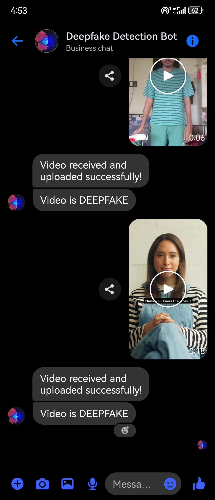
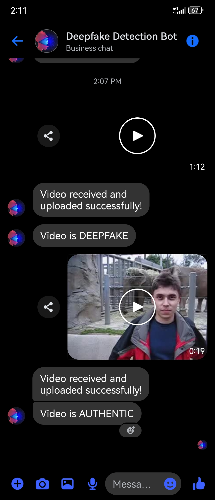

# Deep Fake Detection Bot - Facebook Integration

A mini project by **Gopu**, **Yadhu**, and **Shamir** focused on real-time detection of deepfake videos uploaded to a Facebook Page using AI.

---

## Overview

This bot integrates a deepfake detection system into a Facebook Page using the Facebook Graph API. It automatically scans newly uploaded videos for signs of facial manipulation and provides deepfake classification feedback.  

> **Live Demo Page:** [Deep Fake Detection Page](https://www.facebook.com/share/1FAdnPG8y5/)  
> *(Currently only approved users can interact with the bot)*

---

## Features

- **Real-time deepfake detection** from Facebook uploads.
- **Face-based classification** using MTCNN and EfficientNetV2.
- **Cloud-based processing** for scalability and performance.
- **Backend hosted on Google Cloud and Colab**.
- **Interactive dashboard for reviewing detection results** *(future scope)*.

---

## Demo Results

Sample output images from our detection pipeline:

| Deepfake Detected (Example) | Real Detected (Example) |
|-----------------------------|--------------------------|
|  |  |

---

## Project Structure

```
./
├── cloud code/         # Backend scripts (Flask API, Webhook handlers)
├── colab code/         # Colab notebook for face classification & detection
├── image/              # Sample detection results
└── README.md           # This file
```

---

## Roles and Contributions

- **Gopu**  
  - Project idea, documentation (report, PPT, presentation script)  
  - Structured code documentation and write-up

- **Shamir**  
  - Full backend development  
  - Google Colab integration, cloud deployment (Google Cloud & Cloud Storage)

- **Yadhu**  
  - Workflow management  
  - Setup of Facebook Developer account, Facebook Page, and chatbot system

---

## Tech Stack

- **Frontend/Interaction:** Facebook Page + Graph API  
- **Face Detection:** MTCNN  
- **Deepfake Classification:** EfficientNetV2  
- **Cloud Services:** Google Cloud (GCS, App Engine), Google Colab  
- **Frameworks:** Flask (Webhook API), PyTorch (Model)

---

## Limitations

- Only approved users can currently upload and interact.
- Does not yet support comment or message-based video triggers.
- Optical Flow & Compression Analysis are WIP/experimental.

---

## Future Improvements

- Public user support & open Facebook interactions
- Enhanced results dashboard with temporal analysis
- Optimization of model inference and frame sampling

---

## License

This project is for educational and research purposes only.
